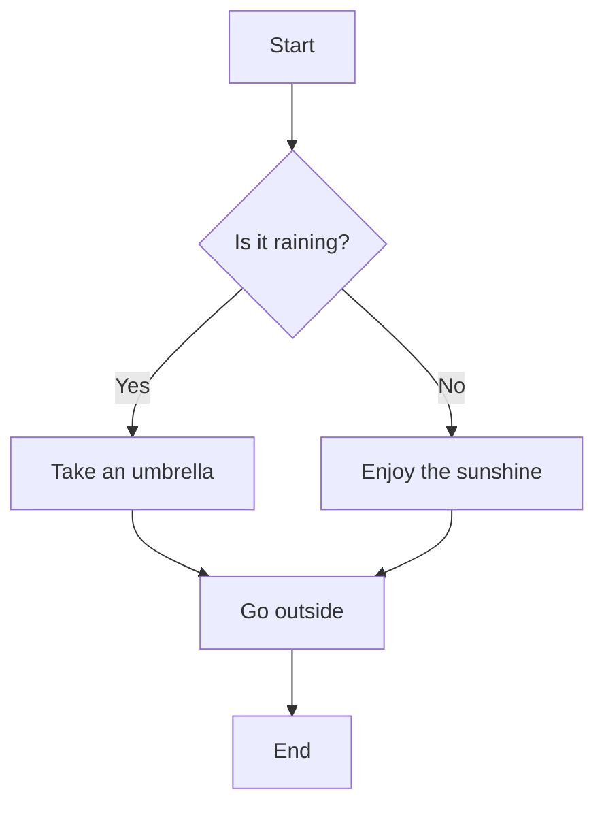
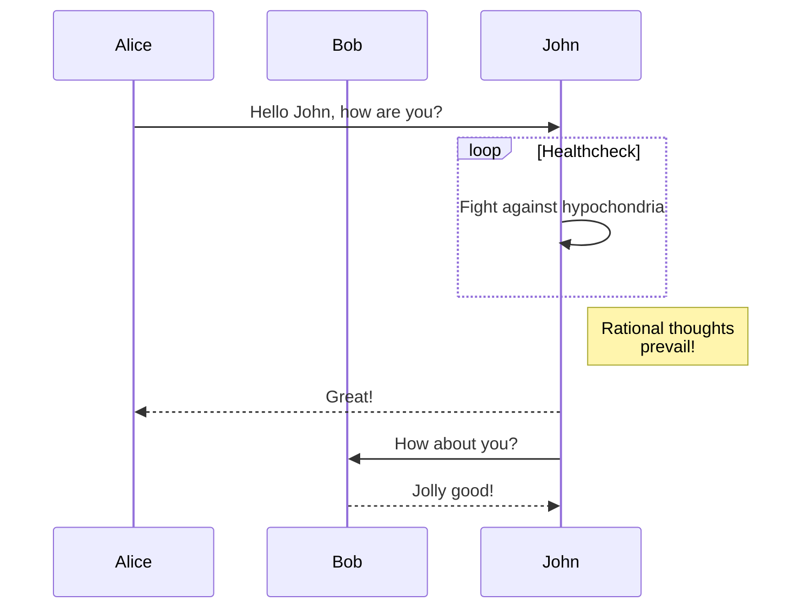
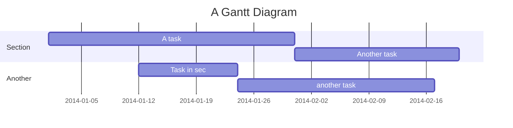
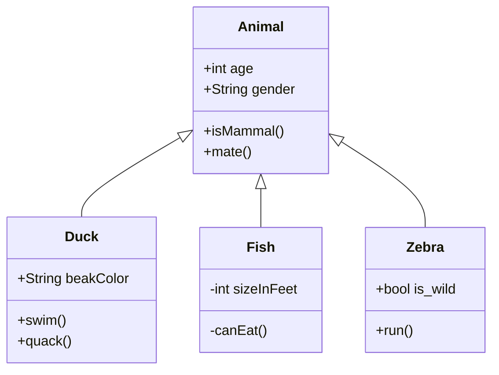

# Mermaid Viewer Example

This is a sample markdown file to test the Mermaid Viewer web application.

## 1. Flowchart Example

## 2. Sequence Diagram Example

## 3. Gantt Chart Example

## 4. Class Diagram Example

Enjoy visualizing your diagrams!
